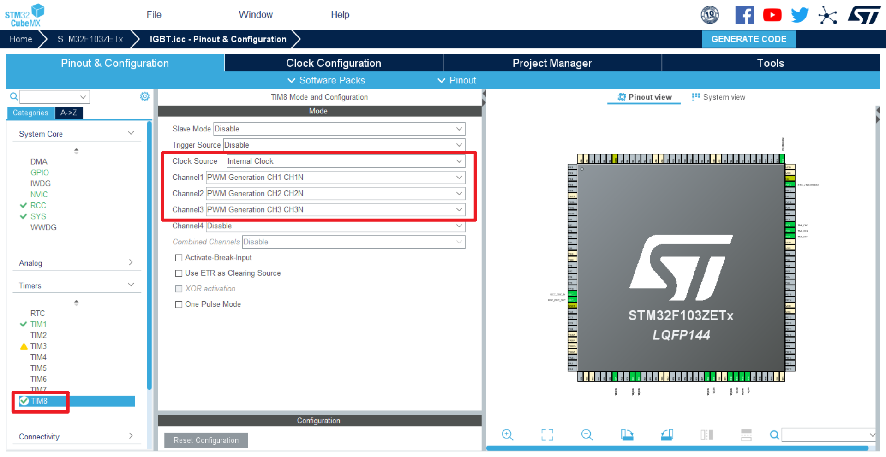
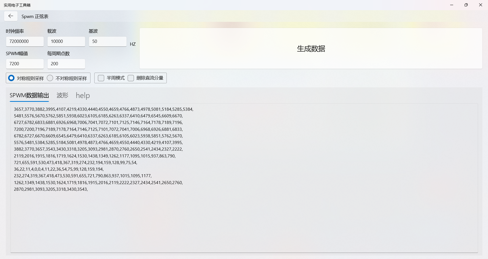

# 使用STM输出互补SPWM波(三相各差120°)

## 1.配置STM32CUBEMX

使能外部时钟源


配置系统时钟树


开启高级定时器8，设置时钟源和输出通道



设置PSC(预分频)为0；计数方式选择(UP)向上计数;设置(APR)计数值为7200

输出载波频率为
$$
72000000/7200=10000HZ
$$


设置Dead Time(死区时间)为72；
$$
72/72000000=0.0000001s=1us
$$


开启定时器更新中断，设置中断优先级


设置定时器通道IO口为高速模式


生成代码

## 2.生成SPWM数据表

设置时钟频率72MHz，载波频率10KHz，基波50Hz




## 3.代码

```c
/* USER CODE BEGIN PD */
#define Deadtime               0  //140  //防止占空比过大或过小，导致生成波形不连续，设置占空比死区时间
/* USER CODE END PD */
```


```c
/* USER CODE BEGIN PV */
uint16_t SinTable[] = {3657, 3770, 3882, 3995, 4107, 4219, 4330, 4440, 4550, 4659, 4766, 4873, 4978, 5081, 5184, 5285, 5384, 5481, 5576, 5670, 5762, 5851, 5938, 6023, 6105, 6185, 6263, 6337, 6410, 6479, 6545, 6609, 6670, 6727, 6782, 6833, 6881, 6926, 6968, 7006, 7041, 7072, 7101, 7125, 7146, 7164, 7178, 7189,7196, 7200, 7200, 7196, 7189, 7178, 7164, 7146, 7125, 7101, 7072, 7041, 7006, 6968, 6926, 6881,6833, 6782, 6727, 6670, 6609, 6545, 6479, 6410, 6337, 6263, 6185, 6105, 6023, 5938, 5851, 5762, 5670, 5576, 5481, 5384, 5285, 5184, 5081, 4978, 4873, 4766, 4659, 4550, 4440, 4330, 4219, 4107, 3995, 3882, 3770, 3657, 3543, 3430, 3318, 3205, 3093, 2981, 2870, 2760, 2650, 2541, 2434, 2327,2222, 2119, 2016, 1915, 1816, 1719, 1624, 1530, 1438, 1349, 1262, 1177, 1095, 1015, 937, 863, 790, 721, 655, 591, 530, 473, 418, 367, 319, 274, 232, 194, 159, 128, 99, 75, 54, 36, 22, 11, 4, 0, 0, 4, 11, 22, 36, 54, 75, 99, 128, 159, 194, 232, 274, 319, 367, 418, 473, 530, 591, 655, 721,790, 863, 937, 1015, 1095, 1177, 1262, 1349, 1438, 1530, 1624, 1719, 1816, 1915, 2016, 2119, 2222, 2327, 2434, 2541, 2650, 2760, 2870, 2981, 3093, 3205, 3318, 3430, 3543};  //SPWM数据表

int32_t CCR1 = 0;  //通道一占空比值
int32_t CCR2 = 0;  //通道二占空比值
int32_t CCR3 = 0;  //通道三占空比值

__IO uint16_t sin1TableIndex = 0;  //通道一SPWM数据表计数值
__IO uint16_t sin2TableIndex = 67;  //通道二SPWM数据表计数值 相位差120°  200 / 3 = 67
__IO uint16_t sin3TableIndex = 133;  //通道三SPWM数据表计数值 相位差240°  200 / 3 * 2 = 133
/* USER CODE END PV */

```

```c
    /* USER CODE BEGIN 2 */
    HAL_TIM_Base_Start_IT(&htim8);  //开启定时器中断
    HAL_TIM_PWM_Start(&htim8, TIM_CHANNEL_1);  //开启定时器8通道一输出
    HAL_TIMEx_PWMN_Start(&htim8, TIM_CHANNEL_1);  //开启定时器8通道一互补输出
    HAL_TIM_PWM_Start(&htim8, TIM_CHANNEL_2);  //开启定时器8通道二输出
    HAL_TIMEx_PWMN_Start(&htim8, TIM_CHANNEL_2);  //开启定时器8通道二互补输出
    HAL_TIM_PWM_Start(&htim8, TIM_CHANNEL_3);  //开启定时器8通道三输出
    HAL_TIMEx_PWMN_Start(&htim8, TIM_CHANNEL_3);  //开启定时器8通道三互补输出
    /* USER CODE END 2 */
```

```c
/* USER CODE BEGIN 4 */
void HAL_TIM_PeriodElapsedCallback(TIM_HandleTypeDef *htim) {  //定时器中断回调函数

    CCR1 = SinTable[sin1TableIndex];  //通道一占空比取值
    CCR2 = SinTable[sin2TableIndex];  //通道二占空比取值
    CCR3 = SinTable[sin3TableIndex];  //通道三占空比取值

    if (CCR1 < Deadtime) {
        CCR1 = Deadtime;
    } else if (CCR1 > (7200 - Deadtime)) {
        CCR1 = 7200 - Deadtime;
    }  //通道一占空比限幅
    if (CCR2 < Deadtime) {
        CCR2 = Deadtime;
    } else if (CCR2 > (7200 - Deadtime)) {
        CCR2 = 7200 - Deadtime;
    }  //通道二占空比限幅
    if (CCR3 < Deadtime) {
        CCR3 = Deadtime;
    } else if (CCR3 > (7200 - Deadtime)) {
        CCR3 = 7200 - Deadtime;
    }  //通道三占空比限幅

            __HAL_TIM_SetCompare(htim, TIM_CHANNEL_1, (uint16_t) CCR1);  //定时器8通道一修改计数值
            __HAL_TIM_SetCompare(htim, TIM_CHANNEL_2, (uint16_t) CCR2);  //定时器8通道二修改计数值
            __HAL_TIM_SetCompare(htim, TIM_CHANNEL_3, (uint16_t) CCR3);  //定时器8通道三修改计数值
    
    sin1TableIndex++;  //通道一SPWM数据表计数值累加
    sin2TableIndex++;  //通道二SPWM数据表计数值累加
    sin3TableIndex++;  //通道三SPWM数据表计数值累加

    if (sin1TableIndex >= 200)
        sin1TableIndex = 0;  //通道一SPWM数据表计数值循环
    if (sin2TableIndex >= 200)
        sin2TableIndex = 0;  //通道二SPWM数据表计数值循环
    if (sin3TableIndex >= 200)
        sin3TableIndex = 0;  //通道三SPWM数据表计数值循环
}
/* USER CODE END 4 */
```

编译，烧录

## 4.示波器测量

互补波形死区时间为1us左右


占空比死区时间设置为140，无间断：


占空比死区时间设置为0，有间断：

输出基波周期为：20ms左右，频率50Hz

载波频率10KHz左右


通道一与通道二相差120°，6.67ms左右
$$
20/3=6.67ms
$$


通道一与通道三相差240°，13.3ms左右
$$
20/3*2=13.3ms
$$


